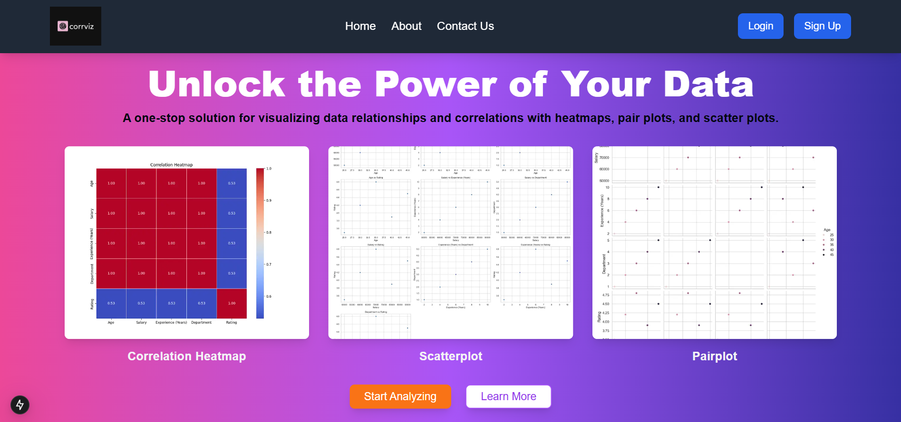
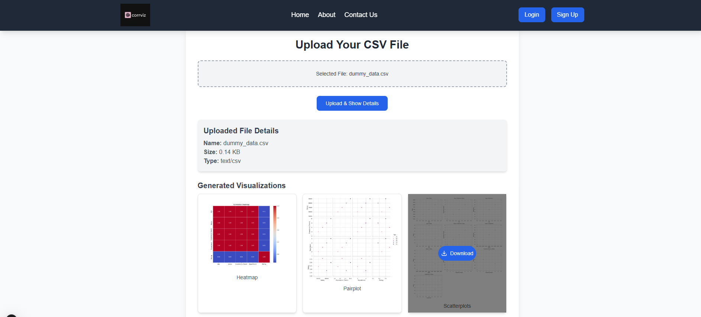
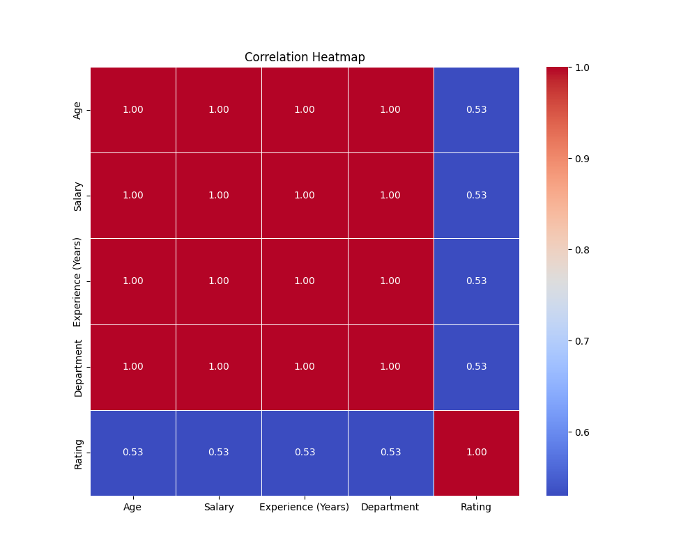
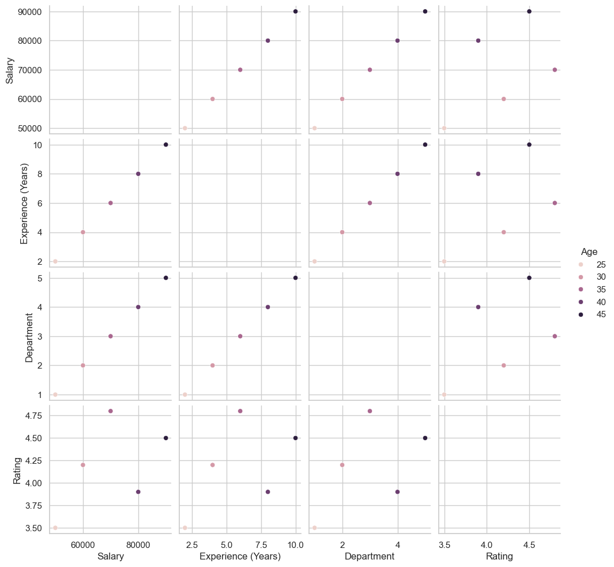
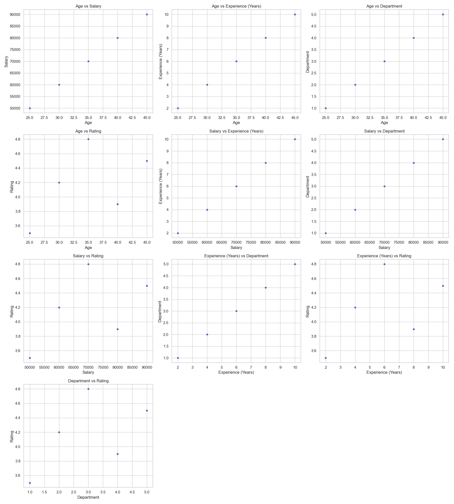

# Data Correlation and Relationship Analytics Tool

A powerful tool that allows users to upload CSV files and generate correlation heatmaps, pair plots, and scatter plots for data analysis. This tool helps in visualizing the relationships and correlations between multiple variables in a dataset.

---

## 📋 Table of Contents
- [Key Features](#key-features)
- [Data Correlation and Relationship Visualization Insights](#data-correlation-and-realtionship-visualization-insights)
- [Tech Stack](#tech-stack)
- [Folder Structure](#folder-structure)
- [Installation](#installation)
- [Build and Run](#build-and-run)
- [Output Images](#output-images)

---

## ✨ Key Features
- Allows users to upload CSV files.
- Generates:
  - **Correlation Heatmap**: A matrix representation of the correlation between different variables in the dataset.
  - **Pair Plot**: Displays scatter plots for each pair of variables in the dataset, showcasing potential relationships.
  - **Scatter Plot**: Visualizes the relationship between two numerical variables, highlighting correlations or patterns.
  
---

## 📊 Data Correlation and Relationship Visualization Insights

### **Correlation Heatmap**
The correlation heatmap is a matrix plot that visualizes the strength and direction of the correlation between different numerical variables in your dataset. It is useful to identify which variables are highly correlated or inversely related. The heatmap color scale typically ranges from -1 (strong negative correlation) to 1 (strong positive correlation), with 0 indicating no correlation.

### **Pair Plot**
A pair plot shows scatter plots between each pair of numerical variables in the dataset. It helps in understanding the relationships between two variables, whether they have a linear or non-linear relationship, and whether any patterns are present. Pair plots often include histograms along the diagonal to show the distribution of each variable.

### **Scatter Plot**
A scatter plot shows the relationship between two numerical variables by plotting them as individual points. It helps in identifying trends, patterns, clusters, or outliers in the data. If the points align in a straight line, it may suggest a linear relationship between the variables.

---

## 💻 Tech Stack
- **Frontend**: Next.js, React.js, TypeScript, Axios
- **Backend**: Node.js, Express.js
- **Styling, Components and Icons**: Tailwind CSS, Shadcn-ui, Lucide-React-Icons
- **Python Microservice**: Python, FastAPI
- **Data Visualization**: Matplotlib, Seaborn
- **Database**: MongoDB 

---

## 📂 Folder Structure
```
Data-Correlation-and-Relationship-Visualizer
├── frontend
│   ├── public
│   ├── src
│   │   └── app
│   │   └── components
│   │   └── lib
│   ├── package.json
│   └── tsconfig.json
├── backend
│   ├── config
│   ├── src
│   │    └── controllers
│   │    └── dao
│   │    └── middleware
│   │    └── models
│   │    └── routes
│   │    └── services
│   │    └── utils
│   │    └── app.ts
│   ├── .env
│   ├── package.json
│   └── tsconfig.json
├── python-microservice
│   ├── app
│   │    └── routes
│   │    └── services
│   │    └── utils
│   ├── requirements.txt
│   ├── run.py
│   ├── .env
│   └── .gitignore
├── README.md

```

---

## 🔧 Installation

### 1. Clone the Repository
```bash
git clone https://github.com/sakshammaggu/CorrViz-Data-Relationship-and-Correlation-Visualizer
cd Data-Relationship-and-Correlation-Visualizer
```

### 2. Install Node Modules and Python Dependencies
#### For Frontend
```bash
cd frontend
npx create-next-app@latest
npm install
```

#### For Backend
```bash
cd backend
npm init -y
npm install
```

#### For Python Microservice
1. Create a Python virtual environment:
   ```bash
   cd python-microservice
   python -m venv venv
   ```
2. Activate the virtual environment:
   - On Windows:
     ```bash
     venv\Scripts\activate
     ```
   - On Mac/Linux:
     ```bash
     source venv/bin/activate
     ```
3. Install the Python dependencies:
   ```bash
   pip install -r requirements.txt
   ```

---

## 🛠️ Build and Run

### 1. Start the Frontend
```bash
cd frontend
npm run dev
```

### 2. Start the Backend
```bash
cd backend
npm run dev
```

### 3. Start the Python Microservice
```bash
cd python-microservice
venv\Scripts\activate  # On Windows
# or
source venv/bin/activate  # On Mac/Linux
python run.py
```

---

## 🖼️ Output Images

Below are visual outputs for each type of data visualization generated by the tool for below dummy file:

### Home Page Frontend



### Dummy CSV File
[Download Dummy CSV File](outputs/dummy_data.csv)

### Correlation Heatmap


### Pair Plot


### Scatter Plot


---